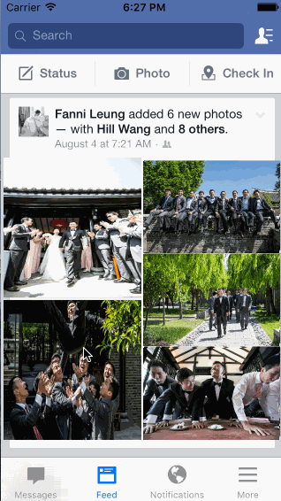

# codepath-assignment5-facebook

This is an iOS facebook application for CodePath submission. 

Time spent: 10 hours spent in total

Completed user stories:

* [x] Setup
    - [x] Use your previously implemented Facebook project. You can also download the sample implementation [here].
    - [x] Add the additional image assets above. Guide
* [x] Basic Layout and Transition
    - [x] In the Storyboard, add the 5 UIImageViews to the feed, remember to enable user interaction for each image view.
    - [x] Add tap gesture recognizers to each UIImageView.
    - [x] Create a PhotoViewController that has an image view embedded in a scroll view and a Done button.
    - [x] Create a modal segue from the FeedViewController to the PhotoViewController and give it a unique identifier.
    - [x] Attach an action to each gesture recognizer (they can be connected to the same action method). In the action, perform the segue. Guide: Performing Manual Segue.
    - [x] Set the image of the PhotoViewController. Guide: Passing Data in Segues
    - [x] Connect the Done button to an action that dismisses the view controller.
* [x] Customize modal transition
    - [x] Create a custom modal transition. Guide: Custom View Controller Transitions
    - [x] In order to move the image, you don't actually move the original UIImageView. Instead, you create a temporary UIImageView, add it to the window, and create a view animation. Upon completion of the animation, remove the temporary UIImageView from the window. Guide: Adding Views to the Window
* [x] Customize dismissal
    - [x] Guide: Custom View Controller Transitions

* [x] Fade on scroll
    - [x] As the user scrolls, modify the background color of the scroll view to be more or less transparent. To create a black color of different alpha values, you can use the method: UIColor(white: 0, alpha: alpha).
    - [x] When the user begins dragging, fade out the done button and action buttons.
    - [x] Guides: Registering for Scroll Events

* [x] Dismiss on scroll release
    - [x] If the content offset is larger than some threshold (e.g., 100 pts) when the user stops dragging, then dismiss the view controller.
    - [x] Otherwise, fade in the done button and action buttons.
    - [x] Guides: Registering for Scroll Events

* [x] Zooming on image view
    - [x] Guide: Zooming in UIScrollView

* [ ] Scrolling through images    
    - [ ] Add the other images to a UIScrollView with paging enabled.
    - [ ] Start the UIScrollView at the correct offset, depending on which photo was selected.
    - [ ] Return the correct image for zooming based on the scroll offset.
 
Notes:

Watched the video tutorial and some other how to’s to dos to make the application.

Walkthrough of all user stories:

GIF created with [LiceCap](http://www.cockos.com/licecap/).